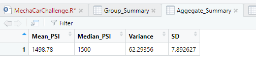
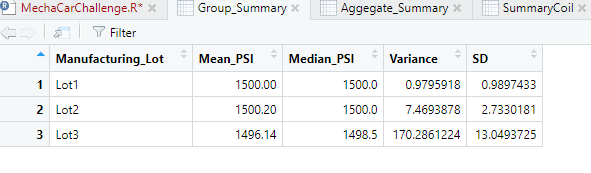

# MechaCar_Statistical_Analysis

### Linear Regression to Predict MPG?
We looked at MPG relative to a combination of
- vehicle length
- vehicle weight
- spoiler angle
- ground clearance
- presence of All Wheel Drive 

We saw that these five factors combined give an R-squared measure of 71.5%, meaning that they explain over 70% of the difference in fuel economy between models.

We also see a p-value of 5.4E-11, meaning that there is near certainty (well over 99.99%) that this model has some predictive value and is not just random fluctuation.

The slope of the each factor in the models differs, but in aggregate, the R-squared measure of over 70% gives is generally considered a good indicator that the slopes assigned by the model, in aggregate, are meaningful.

Looking at Pr(>|t|), it would seem that vehicle length and ground clearance are (maybe surpisingly) the strongest predictors of mpg, with vehicle weight having borderline significance. Spoiler angle and AWD don't seem to add value to the model.

 As a quick test, we reran this regression using only vehicle length, vehicle weight, and ground clearance; this model also explained about 70% of the movement with a similarly low probability of random error - even lower, in fact, than the 5 factor model. So we may want to keep spoiler angle and AWD out of the formula for predictive purposes; we do not want to overfit the model, and these factors don't add much to the analysis.

### Summary Statistics on Suspension Coils

We want to confirm that our coil manufacturing process is reliable. To test this, we will measure the pressure of each batch of coils, see if we are hitting our target of 1500 PSI consistently.

First, looking at our coil collection in aggegate, we see that the mean and median look ok, and the variance is 62, which is within the tolerance of 100 that we consider acceptable.

We noticed that these summary numbers were not consistent with the chart included in the project layout, so just to confirm, we validated these numbers in excel:

We then went on to look at the stats by lot:

Here we see that lots 1 and 2 look OK, but Lot3 shows higher than acceptable variability, at 170.

We would recommend a review of the production process, and in the interim, eacheach shock from lot 3 should be inspected before it is used in a vehicle.

### T-Tests on Suspension Coils

We once again looked at the coils both in aggregate and by lot, this time using a student t test to see if we are comfortably hitting, on average at least, the 1500psi target.

I have included a full printout of the results in the attached file

We are testing the hypothesis that average PSI is 1500. The alternative hypothesis is that the average PSI in NOT 1500. The alternative hypothesis does NOT specify whether the actual is above or below 1500 - either result would be unacceptable for our purposes.

From these, we can see:
- in aggregate, the 95% confidence interval for the production in total is 1497.5 - 1500.1 psi. The p-factor for our hypethesis is 6%, meaning that we have failed to proved the alternative hypothesis.

- Lot1 is rock solid: the 95% confidence interval is 1499.7-1500.3, and the p-value is 1.0.

- Lot2 is solid: the inteval is 1499.4-1501, an the p value is 61%

- Lot3 is a problem; the confidence interval is 1492.4-1499.8, and the p-value is 4%; this means there is greater than a 95% chance that Lot3 will NOT achieve our target pressure.

I would point out that even the aggregate numbers are not comforting; while we have failed to disprove the null hypothesis at the 95% level, we would hope to see the target psi in the middle of the confidence interval, and a p much higher that 6%. If we were to market our cars saying "there is (barely) a 95% change we got the suspension correct" - well - this is not a great slogan.

As Lots 1 and 2 test well, we should avoid using Lot3 shocks if possible, or, if necessary, test each before installation.

### Study Design: MechaCar vs. Competition
MechaCar has tremendous MPG numbers; we average just over 45mpg across all models. As people start to consider electric vehicles, we have to get consumers comfortable with our efficiency.

But we also want people to know - our cars are fun to drive, not just a way to be eco-friendly.

A good metric for this would be to measure performance vs. mileage; for example, plot out hp/mgp or quarter-mile time/mpg for us vs our competitors.

Our claim could be "more fun per gallon", and we back it up with a chart showing 
- y axis: horsepower
- x axis: the inverse of mpg - maybe gallons per 100 miles. This way, our graph should have a positive slope; rather than showing power going down as efficiency goes up, we show power increasing as you use more gas - a positive tradeoff. We would like to should that we have a higher slope than our competitors - you get more fun per your gallon.

For this, we would plot our vehicles, and do a linear regression to show our hp/(gallons per 100 miles), and do the same for our competitors. Once we have the data, the lm() method can provide us with the lines to use on the graph - the slope and the intercept.

The summary of the lm method will also provide us with the r-squared statistic and the p-value; while I do not think this needs to be reflected in our marketing material, Legal should probably take a look at this - we should be comfortable using these statistical indicators to defend the integrity of the graphs we show. To do this, we would want to show that we are testing

#the null hypothesis# - slope of hp/(gallons per 100 miles) is the same for us and our competitor
#alternative hypothesis# - slope is not the same.

If we get negligeable p-value for both our slope and our competitor's slope, and our slope is higher, we should be good to go.

